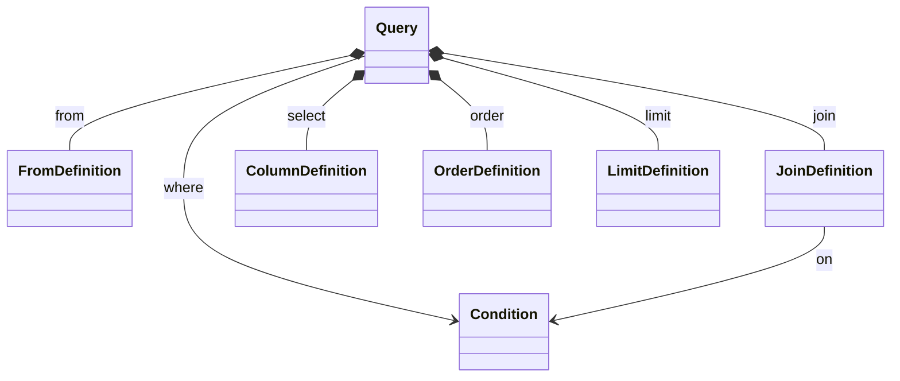

# QueryBuilder

A humble but hopefully eloquent query builder for C#/.Net. Primary purpose is building SQL query statements from idiomatic C# code.

## Patterns and tools used

- [x] Composite pattern to build an object graph representing a SQL-like query structure
- [x] Operator Overloading
- [ ] Builder pattern, kind of
- [ ] Visitor pattern for implementing Sql (and any other) representations. Some research will be needed on my part to get to a satisfying solution here.

## Overview

