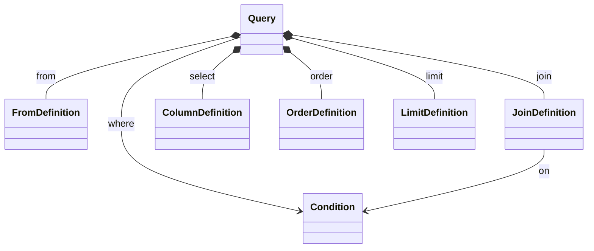

# QueryBuilder

A humble but hopefully eloquent query builder for C#/.Net. Primary purpose is building SQL query statements from idiomatic C# code.

## Example

### Build conditions with code

The following definition

```csharp
var t = new ColumnSelector();
var condition =
      t["col1", table: "other"] == t["col2"] && t["col3"] != 3 ||
      5 == t["col2"] && t["post_id"].References("post");

Console.WriteLine(condition);
```

generates

```sql
((other.col1 = col2 AND col3 != 3) OR (5 = col2 AND post_id = post.ID))
```

## Patterns and tools used

- [x] Composite pattern to build an object graph representing a SQL-like query structure
- [x] Operator Overloading
- [ ] Builder pattern, kind of
- [ ] Visitor pattern for implementing Sql (and any other) representations. Some research will be needed on my part to get to a satisfying solution here.

## Overview


